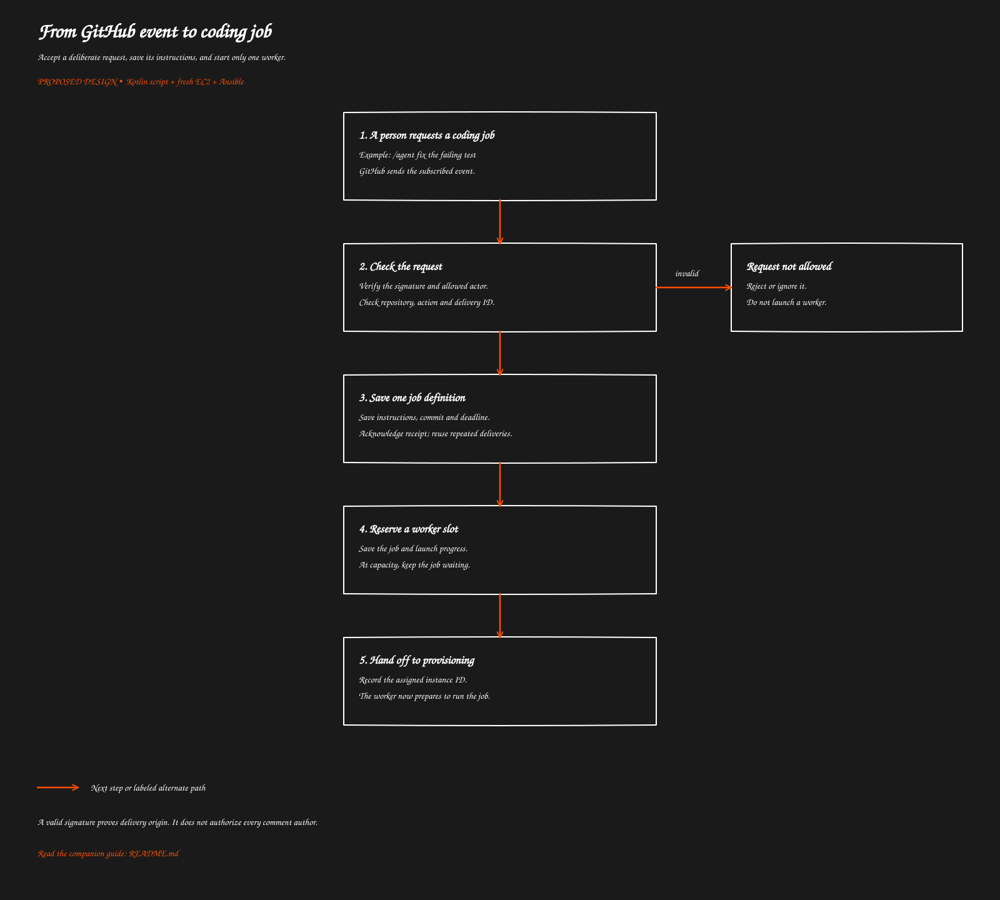

# From GitHub event to coding job

[Overview](../README.md) · [Next: GitHub App and repository access](../02-github-access/README.md)

> Proposed behavior to implement. This guide does not describe deployed functionality.

Accept a deliberate request, save its instructions, and start only one worker.

[Open full-size SVG](flow.svg)

## Purpose

Turn an approved GitHub request into one clear coding task. For example, a maintainer comments “/agent fix the failing test” on an issue. The system saves the request and starts a temporary worker when capacity is available.

This is the proposed behavior. No job intake implementation was found in the inspected repository paths.

## Where it runs and when it is enabled

A repository webhook sends events to an API Gateway URL. API Gateway is the public web address; Lambda is the program handling the request. Enable the feature only for selected repositories, event actions and people. Start with an explicit comment command instead of every push.

The repository webhook can remain separate from the GitHub App. The webhook delivers notifications; the App supplies permission to read and publish code.

## How it works

1. GitHub sends the event body, event type and delivery ID.
2. The receiver verifies the signature against the **original request bytes**, using the configured webhook secret.
3. It checks the repository, event action and person requesting the work. A genuine GitHub event from an unknown commenter must not automatically buy an EC2 job.
4. It saves the delivery ID and one job record together. A retry finds that record instead of creating a second job.
5. It acknowledges the webhook promptly after durable acceptance. Provisioning happens separately; GitHub must not wait for installation or coding.
6. A provisioning handler reserves capacity and launches the worker.

A saved job can also serve as the waiting list for the first version. A scheduled dispatcher retries waiting work. A separate queue can be added later; it does not replace duplicate detection.

## What the job contains

| Saved item | Why it matters |
| --- | --- |
| Job ID and GitHub delivery ID | Track the work and recognize repeated delivery |
| Repository and App installation ID | Select the approved repository identity |
| Requesting person and issue/PR/comment IDs | Explain who requested what and where to find context |
| Instructions | Give the agent a bounded task |
| Base branch and exact starting commit | Record the code version the task starts from |
| Output branch, such as agent/job-123 | Keep the work separate for review |
| Bootstrap release | Choose the Ansible and runner version |
| Deadline and maximum run duration | Bound waiting, installation and execution |
| State and assigned EC2 instance ID | Track progress and control cleanup |

Store secret references if needed, never GitHub tokens or agent API keys in the job definition. Resolve the repository from an approved record rather than accepting arbitrary clone URLs or shell commands from comments.

## What the user sees

The event is accepted for processing, not declared successful. The job later ends with a PR link, a no-change result, or a reason it could not finish. Posting progress comments is optional and needs the corresponding GitHub write permission.

## Edge cases

- **GitHub retries delivery:** return the existing outcome; do not launch again.
- **A worker slot is unavailable:** keep the saved job waiting until capacity or its deadline.
- **The receiver fails before saving:** return failure so delivery can be retried. Also provide an operator recovery path for missed events.
- **The agent pushes its own branch:** ignore bot/output-branch events unless explicitly needed, avoiding a loop.
- **The requested PR comes from a fork:** exclude this from the first release; author trust and write destination need an explicit policy.
- **Context changes while waiting:** record what was requested and what context was fetched. Do not silently switch the starting commit.

## Related code and references

No webhook receiver or job-store implementation is established here. Proposed ownership: webhook handler, job store and provisioning dispatcher.

GitHub: [webhook validation](https://docs.github.com/en/webhooks/using-webhooks/validating-webhook-deliveries), [webhook delivery practices](https://docs.github.com/en/webhooks/using-webhooks/best-practices-for-using-webhooks).

[Overview](../README.md) · [Next: GitHub App and repository access](../02-github-access/README.md)
