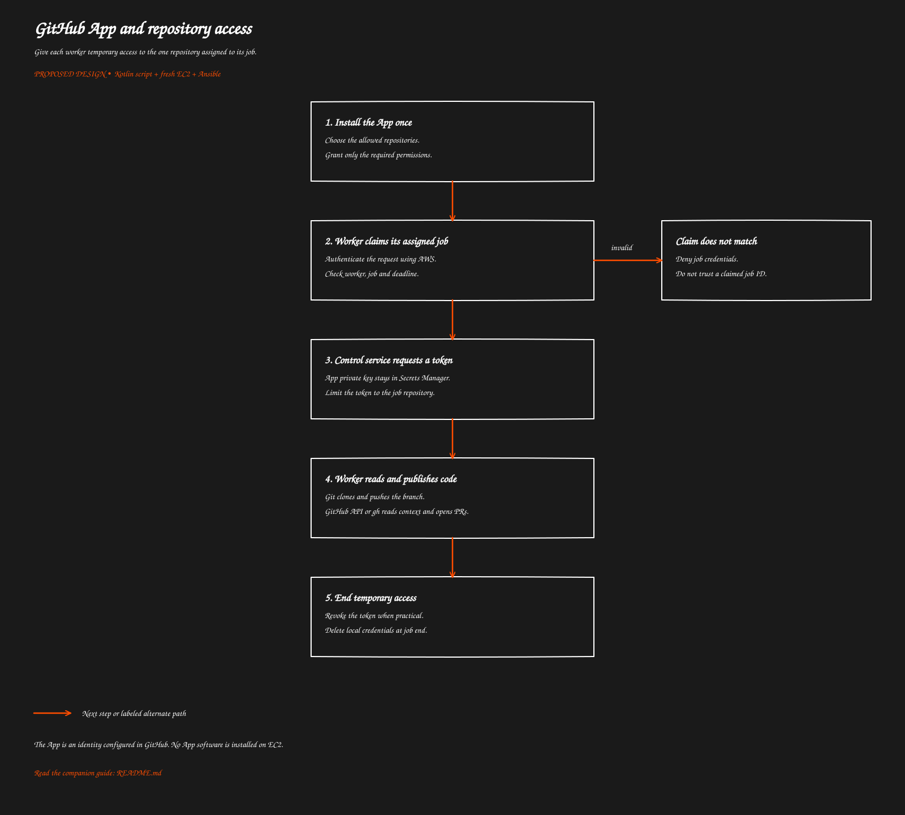

# GitHub App and repository access

[Overview](../README.md) · [Previous: From GitHub event to coding job](../01-job-intake/README.md) · [Next: Fresh EC2 setup with Ansible](../03-ec2-setup/README.md)

> Proposed behavior to implement. This guide does not describe deployed functionality.

Give each worker temporary access to the one repository assigned to its job.

[Open full-size SVG](flow.svg)

## Purpose

The GitHub App is the identity used by automation. The webhook tells AWS that something happened; the App lets the worker read the repository and publish its work.

You create the identity in GitHub settings. The software that uses it lives in your AWS control service and worker.

## Configure it once

Create an organization-owned GitHub App, generate its private key, and install it only on the selected repositories. Save the private key in AWS Secrets Manager and keep the App ID and installation mapping in control-service configuration.

If you retain the repository webhook, the App does not need its own webhook subscription.

| Repository permission | When needed |
| --- | --- |
| Contents: read and write | Clone private code and push a branch |
| Pull requests: read and write | Read PRs and open or update a PR |
| Issues: read | Read issues and their comments |
| Metadata: read | Required baseline access |

Add Issues write only if the system must write issue comments. Review the permission required by the exact comment endpoint; issue discussions and PR review comments use different API routes. Workflow-file changes require separate consideration and are outside the initial permission set.

Repository write access is not restricted to an agent branch by the token itself. Configure repository rules to protect the default and release branches, keep the App out of bypass lists, and enforce the output branch in the publishing script.

## How the worker gets access

1. The worker calls your control endpoint to claim its job.
2. The endpoint authenticates the AWS request and checks the worker assignment, repository and deadline.
3. The control service uses the App private key to create a short signed identity proof, then exchanges it with GitHub for an installation token.
4. It requests access only to the target repository and the permissions that job needs.
5. The worker uses the token for Git and GitHub API requests.

Installation tokens normally expire after one hour. Request one after bootstrap finishes. If a job runs longer, the control service must recheck the active job before issuing a fresh token. Ending the job does not itself expire a token; explicitly revoke it when possible.

## What is installed on EC2

Git is required. GitHub CLI is optional; the Kotlin script can call GitHub's HTTPS API directly. There is no GitHub App executable to install.

Configure Git with a credential helper or askpass helper that reads a temporary credential. Keep the clone URL clean, such as https://github.com/org/repository.git. Do not put a token in the clone URL, command arguments, user-data or logs; a token in the remote URL can remain in Git configuration.

The optional GitHub CLI accepts a token through its process environment. Pass credentials only to commands that need them, rather than automatically giving every agent/build process the publishing token. Docker access and repository code execution affect the strength of that separation.

## What needs to be decided during implementation

AWS authentication alone is insufficient if all workers share the same role and may claim any job ID. The control endpoint needs a verified worker-to-job binding. One option is a per-job claim secret in a separately scoped secret location; another is validated instance-specific session identity with assignment checks. A plain instance ID supplied by the caller is not proof.

A restarted worker should be able to resume the same active claim safely. A different worker must not take it over merely by knowing the job ID.

## Edge cases

An uninstalled App, removed repository or expired token stops authenticated access. Report the reason and clean up the worker. Refresh a token only for a still-authorized job. Never send the App private key to EC2.

The coding agent's provider credential is separate from the GitHub credential.

## Related code and references

The token issuer and worker-authentication check are proposed components, not existing implementations.

GitHub: [installation tokens](https://docs.github.com/en/apps/creating-github-apps/authenticating-with-a-github-app/generating-an-installation-access-token), [installation authentication and Git access](https://docs.github.com/en/apps/creating-github-apps/authenticating-with-a-github-app/authenticating-as-a-github-app-installation).

[Overview](../README.md) · [Previous: From GitHub event to coding job](../01-job-intake/README.md) · [Next: Fresh EC2 setup with Ansible](../03-ec2-setup/README.md)
