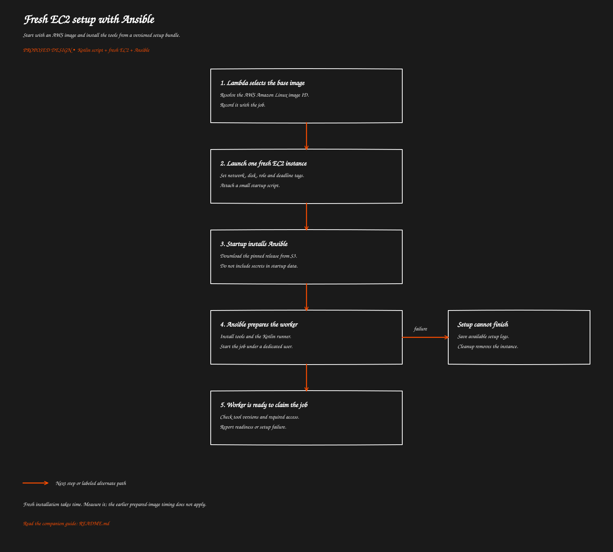

# Fresh EC2 setup with Ansible

[Overview](../README.md) · [Previous: GitHub App and repository access](../02-github-access/README.md) · [Next: The Kotlin job runner](../04-kotlin-runner/README.md)

> Proposed behavior to implement. This guide does not describe deployed functionality.

Start with an AWS image and install the tools from a versioned setup bundle.

[Open full-size SVG](flow.svg)

## Purpose

Each accepted job gets a fresh EC2 machine. AWS maintains the base operating-system image; Ansible installs the tools you require. You do not maintain a custom image or a launch template.

An AMI is the image EC2 boots from. EC2 still requires an AMI ID, even when you use AWS's standard image.

## How it works

1. Lambda resolves an Amazon Linux 2023 image from AWS's public parameter store and records the selected ID.
2. It launches one instance with an approved size, network, disk and worker role.
3. EC2 runs a small startup script, called user-data.
4. That script installs the initial bootstrap tools and downloads a pinned Ansible release from S3.
5. Ansible installs the development tools and the Kotlin runner script.
6. A one-run service starts the script under a dedicated worker account.

Validate Ansible and AWS CLI installation commands against the selected Amazon Linux image. Package names and tool availability should be proven by a fresh-instance test, not assumed from example commands.

## What Ansible installs

| Item | Purpose |
| --- | --- |
| Java and Kotlin | Run the Kotlin script and support the project |
| Git and HTTPS certificates | Fetch and publish repository content |
| Maven support | Build the project; prefer its checked-in Maven wrapper |
| Docker | Run test containers and supporting services |
| Selected coding-agent CLI | Execute the coding task |
| Optional GitHub CLI | Read context and open PRs from the command line |
| Runner script and service definition | Start exactly the assigned job |
| Log upload support | Preserve results before deleting the machine |

For this repository, the existing project guidance specifies Java 25 and Kotlin 2.3.x. Confirm exact versions against the build configuration when implementing the bundle. The Maven wrapper supplies the project's Maven version; a separate system Maven installation may be unnecessary.

Use a single tested CPU architecture across the image and downloaded tools. ARM64 is an option only if the selected agent, Docker images and dependencies support it.

## Lambda language and dependencies

TypeScript with a supported Node.js Lambda runtime is the proposed choice; Node.js 22 was the discussion baseline. Confirm runtime support when deploying.

Package the AWS clients used to launch EC2, read the image parameter, save job state, and read the App key if this function also issues GitHub tokens. Include input validation and a GitHub authentication library when needed. Ansible, Java, Kotlin and Docker belong on the worker.

## Permissions by owner

| Owner | Required access |
| --- | --- |
| Provisioning Lambda | Launch and tag approved EC2 resources; inspect and terminate job instances; pass only the worker role; read the image parameter; write logs and job state |
| Token-issuing handler | Read the specific App private key and job assignment |
| EC2 worker | Read its setup bundle and assigned job inputs; upload its results; obtain only approved job credentials |
| Deployment identity | Create roles, networking, buckets and service configuration |

These are permission requirements, not a ready-to-deploy IAM policy. EC2 launch permissions cover several resource types, including images, network interfaces and volumes. Some describe calls require a wildcard resource. Scope launches through resource restrictions and conditions; restrict termination to managed job instances.

## Network, disk and cost

For a minimal worker, use a public subnet with outbound internet access and no inbound security-group rules. A public address does not require opening SSH. Private workers can use a NAT gateway, which adds hourly and data-processing costs.

Require current instance-metadata protections, encrypt the temporary disk and explicitly enable delete-on-termination for every job volume. Set shutdown behavior to terminate if using guest shutdown as a backup.

Downloading repositories and dependencies is generally free for internet data **entering** AWS. Internet uploads can incur outbound transfer charges. Same-region EC2-to-S3 transfer is generally free, while requests, storage and any applicable network-processing services still cost money.

Measure installation time along with coding time: both consume paid instance time. Public IPv4, temporary disks, retained logs and control services also cost money. Lambda concurrency limits only simultaneous Lambda calls; cap live EC2 workers using saved job reservations.

## Related code and references

The Ansible bundle, launch handler and infrastructure configuration still need implementation. The existing comparison SVGs use earlier assumptions and are not a quote for this design.

AWS: [public AMI parameters](https://docs.aws.amazon.com/systems-manager/latest/userguide/parameter-store-public-parameters-ami.html), [user-data](https://docs.aws.amazon.com/AWSEC2/latest/UserGuide/user-data.html), [data transfer pricing](https://aws.amazon.com/ec2/pricing/on-demand/), [VPC pricing](https://aws.amazon.com/vpc/pricing/).

[Overview](../README.md) · [Previous: GitHub App and repository access](../02-github-access/README.md) · [Next: The Kotlin job runner](../04-kotlin-runner/README.md)
