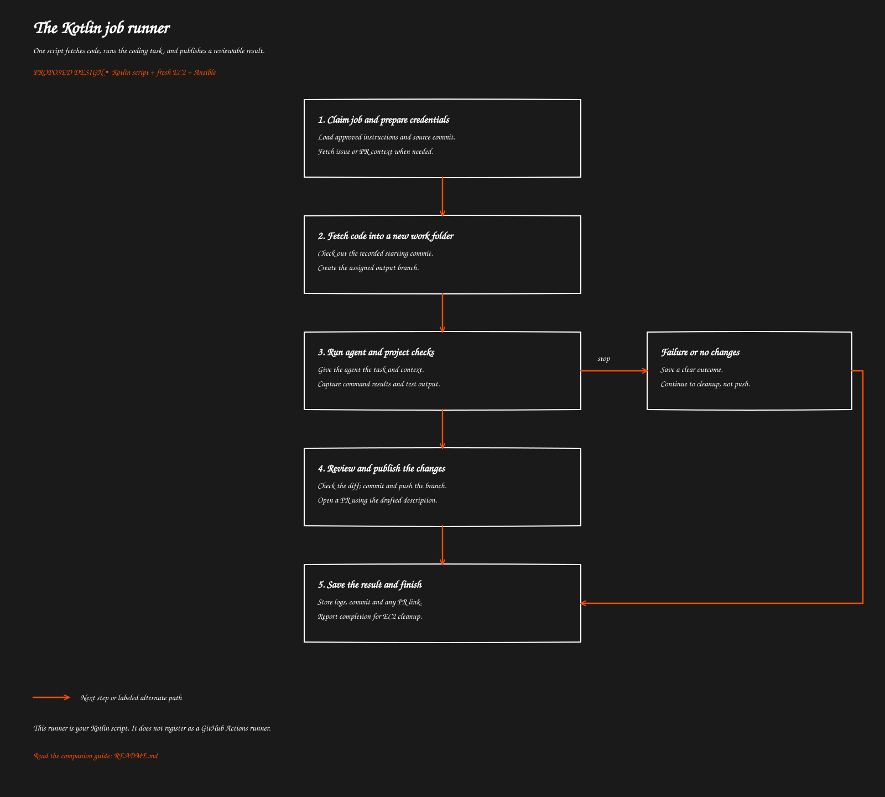

# The Kotlin job runner

[Overview](../README.md) · [Previous: Fresh EC2 setup with Ansible](../03-ec2-setup/README.md) · [Next: Completion and EC2 cleanup](../05-completion-cleanup/README.md)

> Proposed behavior to implement. This guide does not describe deployed functionality.

One script fetches code, runs the coding task, and publishes a reviewable result.

[](flow.svg)

[Open full-size SVG](flow.svg)

## Purpose

The runner is a Kotlin script that pulls code, executes a task and pushes the result. One machine runs one job. The machine can disappear once the work is saved.

No GitHub Actions runner registration is involved. The GitHub App token authorizes repository access.

## What installation looks like

Keep the following files in a versioned bootstrap source repository, then publish a release bundle to S3:

```text
bootstrap/
  playbook.yml
  runner/
    run-job.main.kts
    agentic-job.service
    runner-settings.json
```

Ansible installs the script, non-secret settings and a service definition. A service is the operating system's way to start the process, collect its output and apply a time limit. Run it once, with automatic restart disabled unless job resumption is implemented.

Launch the installed script with Kotlin. A main script needs executable top-level code; declaring a main function alone does not invoke it automatically.

Pin the script's libraries as well as its source. If libraries are resolved during startup, account for network failures and time. If shipping JAR dependencies, explicitly configure the Kotlin classpath and verify the exact launch command on a fresh worker. A compiled Kotlin runner is a later option.

## How one job runs

1. Claim the assigned job and obtain scoped credentials.
2. Fetch the approved repository into an empty work directory.
3. Check out the saved source commit and create the job's output branch.
4. Fetch relevant issue text, PR changes and comments. Save enough context to explain the agent's decision later.
5. Call the agent with the task, repository location, context and limits.
6. Run the required project checks and capture their exit codes.
7. Inspect the final diff and ask the agent to draft a commit message and PR description.
8. Commit and push the assigned branch, then create the PR.
9. Upload logs and the result before notifying the control service that the machine may be removed.

Treat repository content and comments as task material, not authority to change credentials, destination repository or execution limits. The script controls publishing and completion even if the agent drafts the text.

## Process execution requirements

Use argument lists when starting Git, the agent or build tools; do not construct shell commands from comment text. Set the working directory explicitly, capture output and enforce time limits. Stop on nonzero exit status unless that exact outcome is handled.

Avoid blanket “ignore commit failure” logic. Check for an empty diff separately; a failed commit can indicate a real error.

The first release should publish only after required checks pass. A failed check records failure and retains logs or a patch for inspection. Publishing a draft PR after failed tests can be an explicit later policy.

## What the user sees

| Outcome | Visible result |
| --- | --- |
| Changes pass checks | New branch and PR with summary and test result |
| Nothing to change | No empty commit or unnecessary PR; explain the no-change result |
| Tests or agent fail | Failure reason and saved diagnostic output |
| Push is rejected | Publish failure; no force push |
| Push succeeds but PR creation fails | Save branch and commit so PR creation can be retried |

Before retrying publication, check for the existing branch, commit and PR for that job. A repeated completion request must not produce duplicate PRs.

## Cleanup limits

Use guarded cleanup so a log-upload error does not suppress the completion request. Upload logs continuously where practical and preserve the original failure when cleanup also fails.

A script's final cleanup block cannot run after every crash, forced kill or machine failure. Independent timeout cleanup is required; see the next guide.

## Related code and references

Proposed installed script: /opt/agentic-runner/bin/run-job.main.kts. No runner implementation was found in the inspected source, workflow or script paths.

Kotlin: [custom scripting and main-kts](https://kotlinlang.org/docs/custom-script-deps-tutorial.html). GitHub: [creating pull requests through the API](https://docs.github.com/en/rest/pulls/pulls#create-a-pull-request).

[Overview](../README.md) · [Previous: Fresh EC2 setup with Ansible](../03-ec2-setup/README.md) · [Next: Completion and EC2 cleanup](../05-completion-cleanup/README.md)
