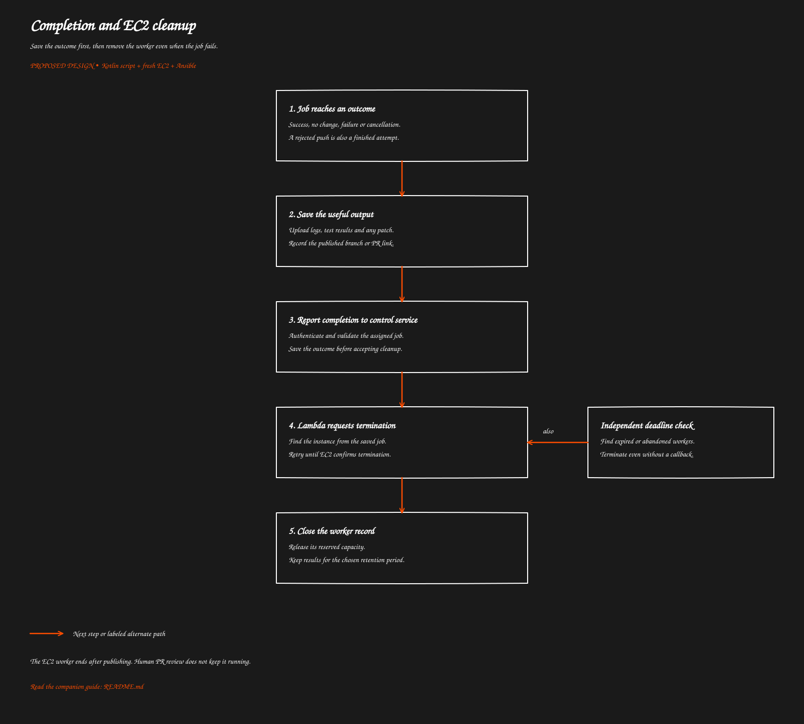

# Completion and EC2 cleanup

[Overview](../README.md) · [Previous: The Kotlin job runner](../04-kotlin-runner/README.md) · [Next: Steps to deliver the project](../06-build-plan/README.md)

> Proposed behavior to implement. This guide does not describe deployed functionality.

Save the outcome first, then remove the worker even when the job fails.

[Open full-size SVG](flow.svg)

## Purpose

Stop paying for the worker once it has finished its attempt. Success, rejected pushes, failed tests and cancellations all lead to cleanup.

A reviewer declining the PR later has no running machine to stop. An approved follow-up request creates a new job and worker.

## Normal completion

1. The runner uploads useful output and records its outcome.
2. It calls the completion endpoint using its authenticated job identity.
3. The endpoint checks that the caller owns the assigned active job.
4. It saves the outcome and marks the worker as needing termination.
5. Lambda requests termination using the instance ID already stored by the control service.
6. A follow-up check confirms EC2 is terminated before releasing the worker slot.

A completion request contains job outcome and result locations; it must not let a caller choose an arbitrary EC2 instance to terminate.

Keep job outcome separate from resource cleanup state. For example, the coding job can be successful while its worker is still awaiting termination.

## When the normal path breaks

A scheduled cleanup Lambda checks for expired jobs, instances awaiting termination and managed instances without a valid active job. It reconciles the saved job records with EC2 tags, so a crash between launching an instance and saving its ID can still be recovered.

The provisioning call also needs a stable launch request identifier for retries. Duplicate webhook detection alone does not prevent duplicate EC2 instances after a launch timeout.

If completion notification fails, retry for a bounded time. The independent cleanup check eventually removes the worker. It should mark an unknown outcome as timed out or lost, not pretend the job succeeded.

Do not rely on a database record's automatic expiry to stop the instance. Expiring a record does not call EC2, and automatic deletion is not a precise timer.

## Optional shutdown backup

Configure EC2's guest shutdown behavior as terminate. A trusted service wrapper can shut down after the runner finishes or exceeds its time limit. This avoids giving the coding process broad EC2 termination rights.

This is a backup, not the only cleanup mechanism: boot can fail before the service starts. The external deadline check remains responsible for that case.

## What is retained and removed

The worker and all job volumes configured for deletion are removed. GitHub branches and PRs remain. S3 logs and artifacts remain until their retention rule removes them.

Revoke the repository token when possible and remove temporary local credentials. Do not wait for token expiry to stop EC2. Do not let token-revocation failure indefinitely block termination.

## Operational checks

Record job ID, instance ID, outcome, termination request and confirmed termination. Alert when workers live beyond their deadline or termination repeatedly fails. Decide the runtime limit, cleanup interval and result retention before enabling real jobs.

Cancellation uses the same cleanup path. Give a brief bounded opportunity to save output when possible, but do not extend the worker indefinitely.

## Related code and references

The completion endpoint, termination handler and scheduled cleanup handler remain to be implemented.

AWS: [instance termination](https://docs.aws.amazon.com/AWSEC2/latest/UserGuide/terminating-instances.html), [shutdown behavior](https://docs.aws.amazon.com/AWSEC2/latest/UserGuide/Using_ChangingInstanceInitiatedShutdownBehavior.html), [EC2 retry safety](https://docs.aws.amazon.com/ec2/latest/devguide/ec2-api-idempotency.html).

[Overview](../README.md) · [Previous: The Kotlin job runner](../04-kotlin-runner/README.md) · [Next: Steps to deliver the project](../06-build-plan/README.md)
