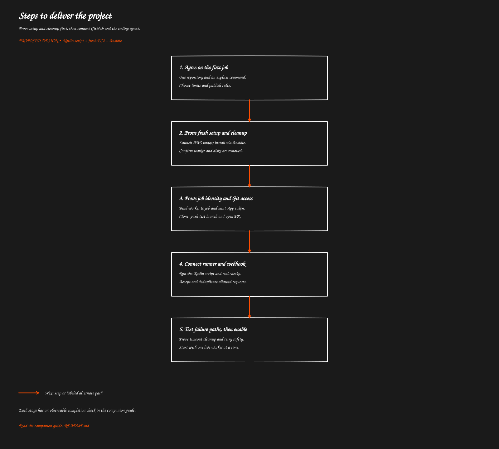

# Steps to deliver the project

[Overview](../README.md) · [Previous: Completion and EC2 cleanup](../05-completion-cleanup/README.md)

> Proposed behavior to implement. This guide does not describe deployed functionality.

Prove setup and cleanup first, then connect GitHub and the coding agent.

[Open full-size SVG](flow.svg)

## Purpose

Build a small working system in stages. Each stage should prove one part of the project before adding another. These are implementation steps, not completed work.

## 1. Choose the first supported job

Pick one repository and a maintainer-only comment command. Define the target branch, permitted people, tool versions, maximum job duration, output retention and one-worker starting limit.

Decide which agent CLI to install and how its provider credential is supplied. For the first release, exclude untrusted fork jobs and require passing checks before publication.

**Done when:** an example request has an agreed job definition and clear success/failure outcomes.

## 2. Prepare GitHub and AWS resources

Create the GitHub App and install it on the test repository. Set repository rules. Create the result/setup buckets, secret storage, job table, public webhook endpoint, Lambda roles and worker networking.

Keep separate configuration for webhook verification, App token issuing and coding-agent authentication. These are three different credentials.

**Done when:** the App can access only selected repositories and the worker role has only the required AWS access.

## 3. Prove a fresh machine can prepare itself

Create the versioned Ansible bundle and a placeholder Kotlin script that records “setup complete.” Launch from the AWS-managed image, download the bundle and run the placeholder through a one-run service.

Test the actual Java/Kotlin versions, Maven wrapper, Docker and CPU architecture on that fresh machine.

**Done when:** a new worker becomes ready without a custom image, manual SSH work or credentials embedded in user-data. Record startup duration and the selected image ID.

## 4. Implement termination before real coding

Build completion handling and scheduled cleanup. Set disk deletion, job deadlines and launch retry protection. Test a worker that never reports completion.

**Done when:** normal completion and a broken bootstrap both end with a terminated instance and removed temporary volumes. Retained output is still readable.

## 5. Prove worker identity and repository access

Implement the worker claim check and token issuer. Test wrong-job claims, expired jobs and token renewal. Clone a test repository, push an intentional test change to the assigned branch and create a PR.

**Done when:** a worker cannot claim another job; Git uses a clean remote URL; the App private key never reaches EC2.

## 6. Implement the real Kotlin runner

Add context collection, agent invocation, project checks, diff inspection, commit/PR drafting and controlled publishing. Add bounded command execution, credential cleanup and recoverable result reporting.

**Done when:** one manually submitted job produces a reviewable PR, preserves test evidence and cleans up the machine. A no-change job exits cleanly without an empty commit.

## 7. Connect webhook intake

Verify signature bytes, authorize the requester, save the delivery ID and job, and acknowledge promptly. Connect accepted records to the provisioning dispatcher.

**Done when:** one allowed GitHub comment starts one job, duplicate deliveries reuse it, and the bot's own push does not start a loop.

## 8. Exercise failures before enabling routine work

| Test | Expected evidence |
| --- | --- |
| Invalid signature or unapproved commenter | No job launch |
| Same delivery sent twice | One saved job and one worker |
| Launch response is lost | Retry does not create another worker |
| Worker capacity is full | Job waits without exceeding the live-instance limit |
| Fresh setup fails | Available logs retained; deadline cleanup terminates worker |
| Wrong worker claims a job | No job data or repository token returned |
| Token expires during a long job | Renew only for an authorized, active job |
| Agent or tests fail | Clear failure; no successful-publication claim; cleanup |
| Push denied | No force push; saved reason; cleanup |
| PR creation fails after push | Branch recorded; retry reuses it |
| Completion endpoint unavailable | Bounded retry and external cleanup |
| Worker killed before final cleanup | External cleanup still terminates it |
| PR is later declined by reviewer | No old worker remains running |

**Done when:** the test evidence includes job states, instance IDs, result locations and confirmed termination.

## 9. Enable gradually and measure

Begin with one concurrent worker. Measure setup time, agent time, total instance time, success rate, termination delay and per-job cost. Include disks, IPv4, retained output, service requests and any NAT gateway.

Increase capacity only after retries and cleanup are reliable. If installation dominates cost or wait time, improve the pinned bootstrap download/cache path before revisiting the user's choice of fresh images.

**Done when:** an operator can find any job's request, code result, cost inputs and cleanup status without logging into EC2.

## Related code

All implementation paths are still to be chosen. Expected deliverables: infrastructure configuration, webhook/provisioning/completion handlers, job store, token issuer, Ansible release bundle, Kotlin runner, cleanup schedule and focused failure tests.

[Overview](../README.md) · [Previous: Completion and EC2 cleanup](../05-completion-cleanup/README.md)
