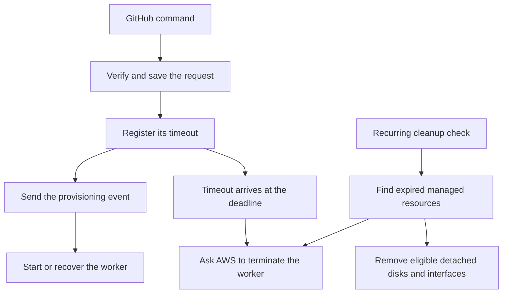

# Follow a request through the system

Imagine someone comments `/agent fix the failing test` on issue 456. GitHub sends that comment to this application. The application checks where it came from, remembers the request, arranges a timeout, and sends a message asking for a worker.

A separate Lambda call receives that message and starts an EC2 instance—an AWS virtual machine. When the request’s thirty-minute deadline arrives, another call asks AWS to terminate it. A recurring cleanup check catches expired workers and detached resources left behind.

This guide follows the current source code. It explains what the application is written to do; it does not establish that a deployment has run successfully.

## Read the journey

| Chapter | The question it answers |
| --- | --- |
| [1. Receiving the request](01-intake.md) | How does a GitHub comment become something we can process? |
| [2. Saving and passing it on](02-dispatch.md) | What must happen before GitHub receives an acknowledgement? |
| [3. Starting the worker](03-provision.md) | How do we launch a machine and recover from a lost response? |
| [4. Ending the worker’s lifetime](04-termination.md) | How do timeout and cleanup remove resources? |
| [5. What the system remembers](05-data-ledger.md) | Which information survives after each call? |
| [6. When something goes wrong](06-failures-and-wiring.md) | What can be retried, and which settings connect everything? |

## Several short calls, one shared request

GitHub receives HTTP 202 after the request is saved, its timeout is registered, and its provisioning event is accepted. That response means the handoff succeeded. The worker may not have started yet.

EventBridge, AWS’s event delivery service, later calls `/provision`. Scheduler sends the timeout event that reaches `/timeout`. A separate recurring schedule reaches `/cleanup`. Each call has its own log request ID, but the GitHub `deliveryId` ties the work together.

The [current launch code](../../src/aws/EC2Service.ts) boots Ubuntu but supplies no startup script or worker role. Repository checkout, Ansible setup, the Kotlin runner, agent execution, and PR publication belong to the [planned workflow](../architecture/agentic-coding/README.md).

## The journey at a glance

The [original overview SVG](00-overview.svg) and chapter SVGs are historical implementation snapshots. They show older retry behavior and connections that were missing at the time. The flow above and this guide describe the current source.
